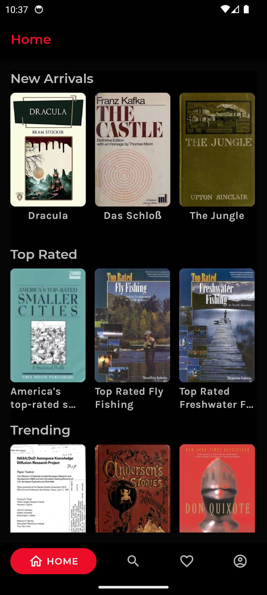
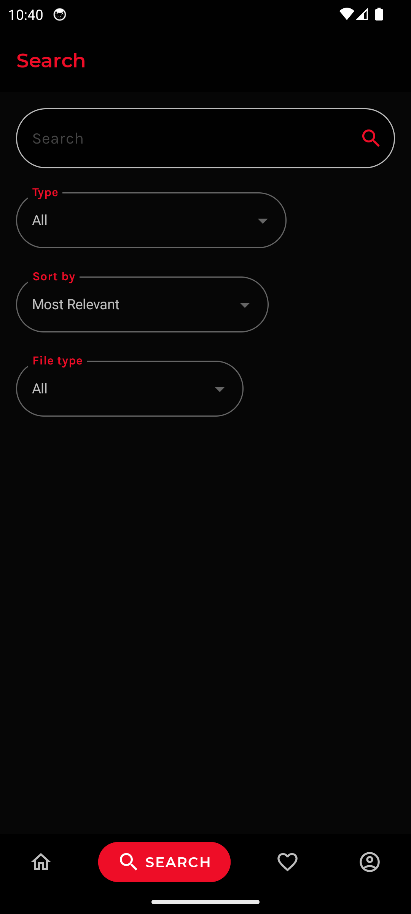
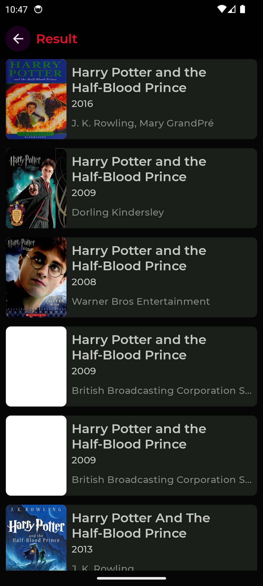
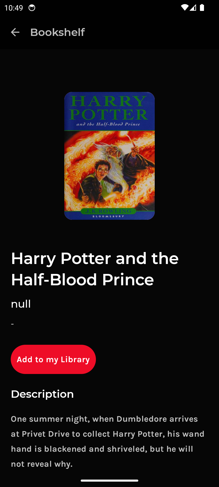
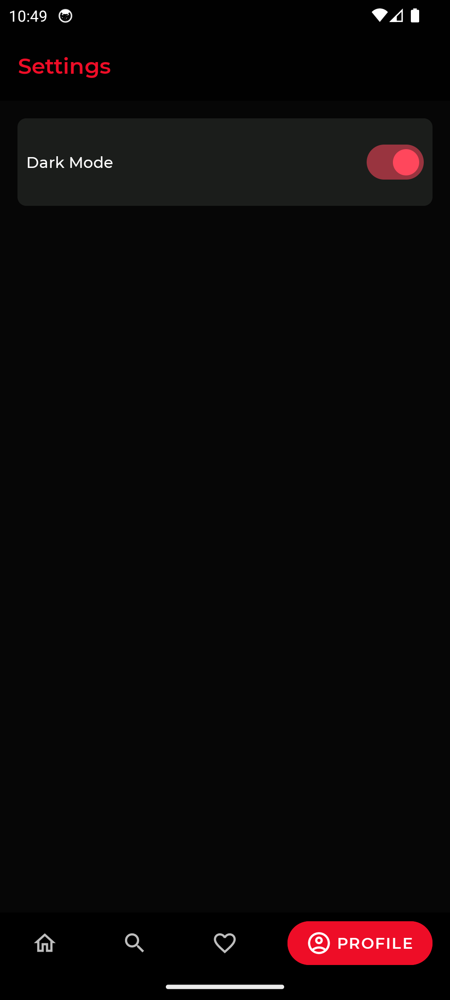

# BookShelf

BookShelf is a lightweight Android app for browsing, searching, and reading book information using the OpenLibrary API.

## Note 

**WARNING:** This App Is In Beta Stage, So You May Encounter Bugs. If You Do, Open An Issue In Github Repository.

## Screenshots

[](Screenshots/Screenshot_1.png)
[](Screenshots/Screenshot_2.png)
[](Screenshots/Screenshot_3.png)
[](Screenshots/Screenshot_4.png)
[](Screenshots/Screenshot_5.png)

## Features

- View recent and popular books  
- Search by title, author, or subject  
- Browse by category  
- Read book descriptions, author info, and publication details  
- Planned: Favorites list  
- Planned: Dynamic home sections like new arrivals and top-rated

## Build Instructions

1. Install [Android Studio](https://developer.android.com/studio)  
2. Clone the repository:
   ```sh
   git clone https://github.com/kanishkdhebana/BookShelf2.git
   cd BookShelf2
3. Open the project in Android Studio or run from the terminal:
   ```sh
   ./gradlew assembleDebug
4. Ensure Gradle is synced and all dependencies are resolved before building.
